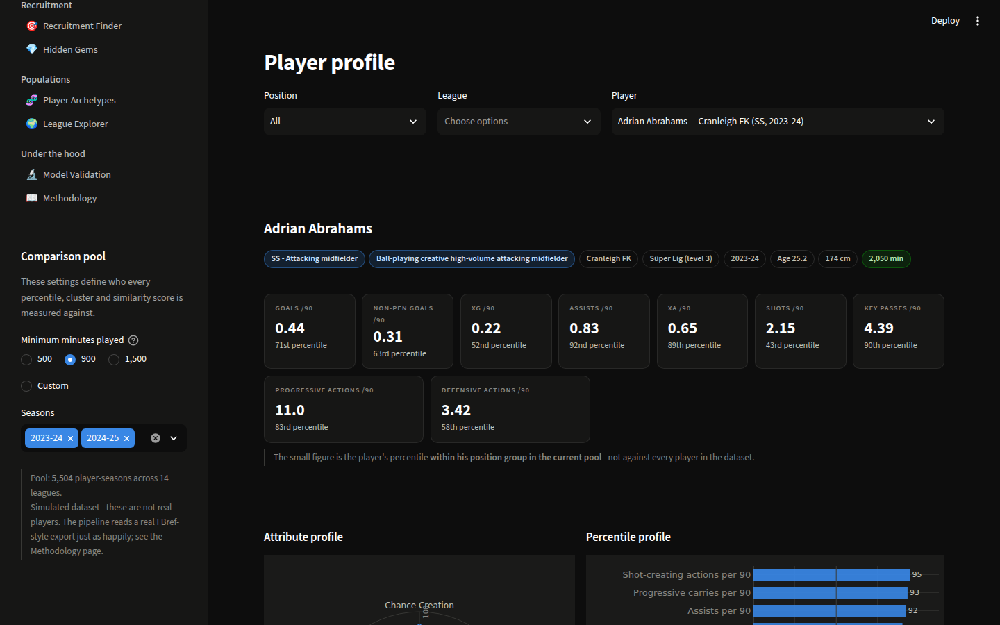
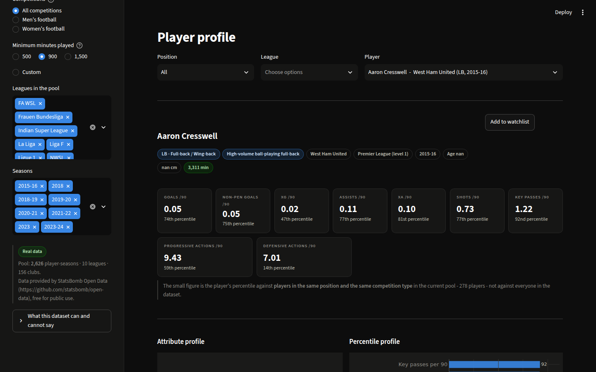
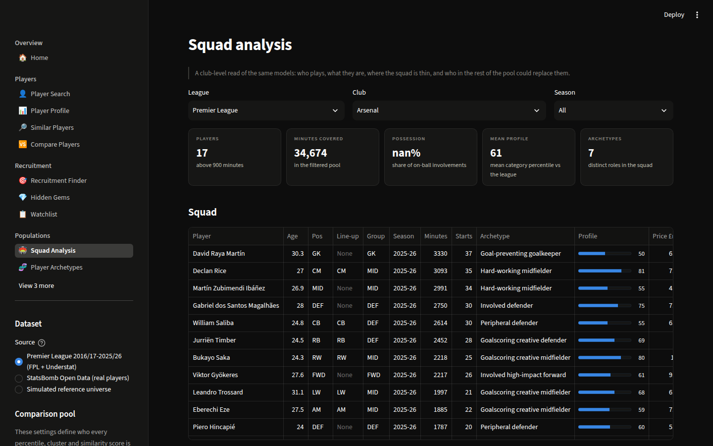
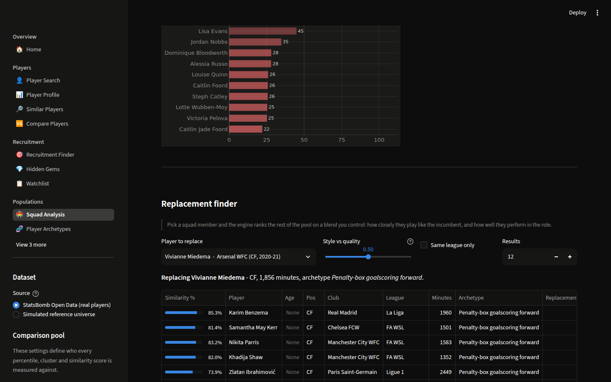
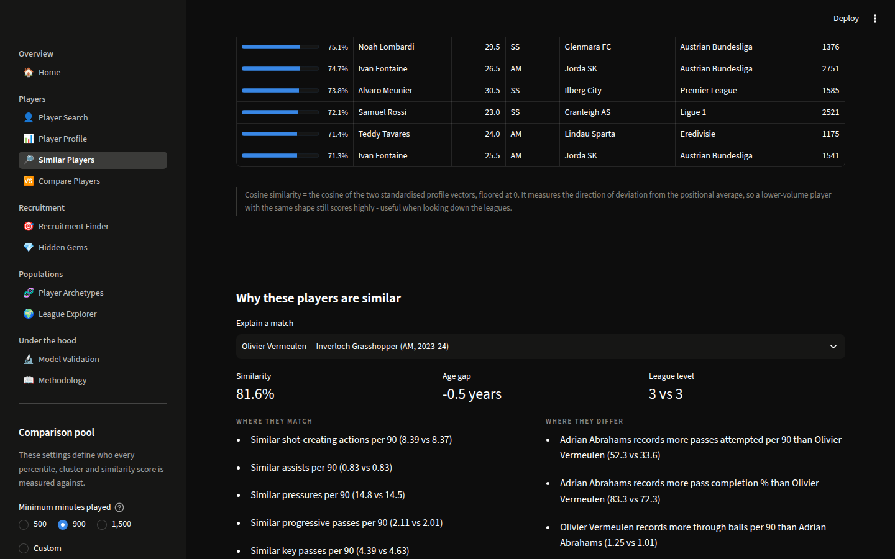
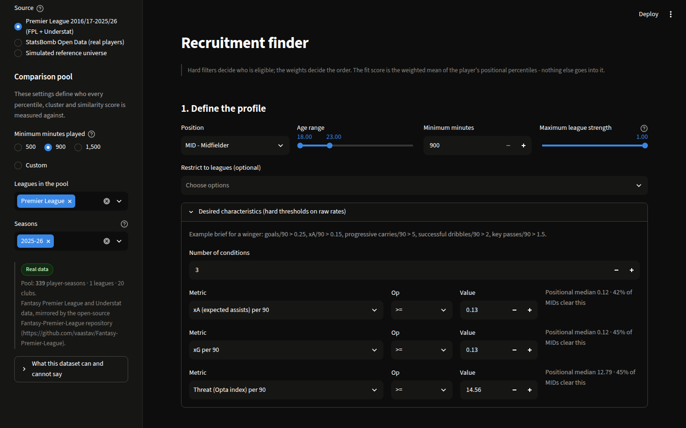
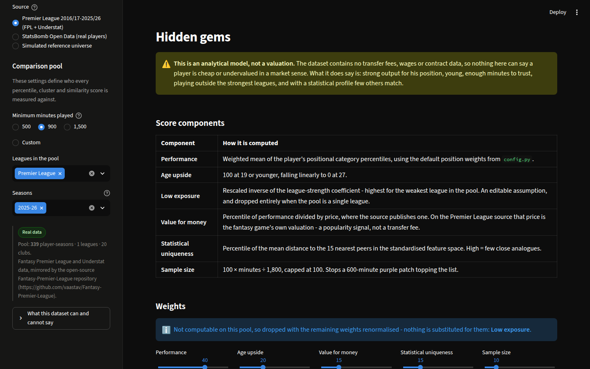
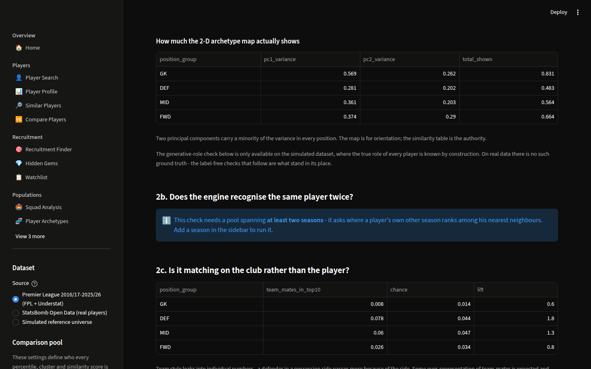
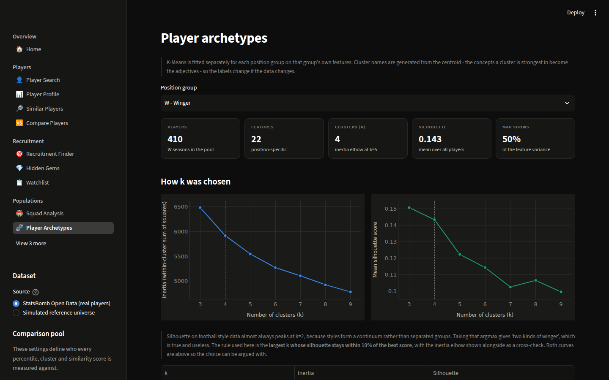
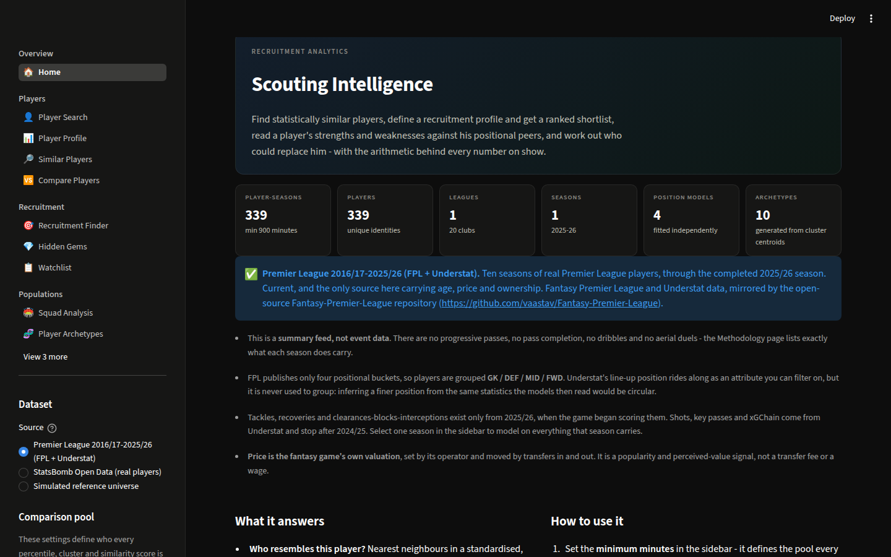

# Football Player Scouting & Recruitment Intelligence Platform

A position-aware scouting and recruitment analytics platform running on **real match data**:
find statistically similar players, turn a recruitment brief into a ranked shortlist, read a
player's strengths and weaknesses against his positional peers, and work out who could replace
him — with the arithmetic behind every number on show.

Three real datasets, switchable in the sidebar, plus a simulated one used to validate the models:

| Dataset | Coverage | What it is good for |
| --- | --- | --- |
| **Big five leagues** (default, committed) | **Five seasons, 2017/18 → 2021/22** · Premier League, La Liga, Serie A, Bundesliga, Ligue 1 · **13,230 player-seasons, 5,309 players** | The widest and deepest, and the only one supporting all **ten position groups**. Full match-data metrics — pressures by third, carries into the box, post-shot xG — plus a **true position**, **side of the pitch** and a **real market value in euros**. Ends in 2021/22. |
| **Premier League** (committed) | **Ten seasons, 2016/17 → the completed 2025/26** · 5,343 player-seasons | Current squads, with **age, price and ownership**. A summary feed: no progressive passes or duels. |
| **StatsBomb Open Data** (committed) | 2,384 matches → 4,989 player-seasons across 10 competitions | Depth. Every metric derived from raw events — progressive actions, pressures, aerials, pass completion under pressure. The newest complete men's league season published openly is 2015/16. |
| **Top six leagues** (Transfermarkt) | Big five + Liga Portugal, any season · **build it yourself** | **Real market values in euros**, true positions (centre-back, not "defender"), age, height, foot, nationality. Thin on performance: appearances, goals, assists, cards, minutes. |
| **Simulated** (committed) | 14 leagues × 2 seasons | The only way to score an unsupervised model against known ground truth. |

Positions in the big-five dataset come from **Transfermarkt**, joined through a curated 15,440-row
URL mapping — an independent source, so grouping players by position is not inferred from the same
statistics the models then read. How *finely* to group them is not guessed either: a classifier
decides which splits the data supports, and [the evidence is on the table below](#ten-position-groups-and-the-splits-are-measured).

Built with **Python · pandas · NumPy · scikit-learn · Plotly · Streamlit**.

**Live app:** _not yet deployed_ — [Deploying it](#deploying-it) takes about three minutes on
Streamlit Community Cloud, and is free. Paste the `*.streamlit.app` URL here once it is up.

```bash
pip install -r requirements.txt
streamlit run app.py
```

The real dataset is committed, so the app runs immediately — no downloads or API keys needed.



<details>
<summary>More screenshots</summary>

**Percentile profile — measured against the right peer group**



**Squad analysis — Arsenal WFC, with archetypes generated from the data**



**Replacement finder — style versus quality, on a slider**



**Similar players, with the reason behind the match**



**Recruitment finder — weights and shortlist**



**Hidden gems — young, cheap, high-output, 2025/26**



**Model validation — including where the models are weakest**



**Archetypes — how k was chosen**



**Home — pool composition and the cleaning report**



</details>

---

## The data

### The big five leagues, 2017/18 → 2021/22 (the default)

The Premier League, La Liga, Serie A, Bundesliga and Ligue 1 — **13,230 player-seasons, 5,309
players**, roughly 460–600 per league per season. `src/fbref.py` builds it from three public files,
all mirrored in [JaseZiv/worldfootballR_data](https://github.com/JaseZiv/worldfootballR_data):

| File | What it gives |
| --- | --- |
| FBref season stats, eleven blocks per player | Standard, shooting, passing, pass types, shot- and goal-creating actions, defence, possession, playing time, miscellaneous, two goalkeeping blocks. |
| A curated FBref → Transfermarkt mapping | 15,440 hand-checked URL pairs. |
| Transfermarkt season squads | Market value for that season, a specific position, height, preferred foot, nationality, date of birth. |

**Why the join is the point.** FBref records a position as `DF`, `MF`, `FW` or `GK`. Transfermarkt
records "Centre-Back", "Left-Back", "Defensive Midfield", "Right Winger". Taking the position from
Transfermarkt means the eight position groups are fixed by an **independent source**, not inferred
from the same statistics the models then read. 99.9% of player-seasons match, 99.8% carry a
specific position, 97.5% a market value for that exact season.

It measures the things that separate players who look identical in a summary table: pressures by
third of the pitch, tackles by third, touches by zone (own box → opposition box), carries and
progressive carry distance, carries into the final third and into the area, passes by distance
band, through balls and switches, shot-creating actions broken down by *how* they were created,
and for goalkeepers post-shot xG, cross-stopping and sweeper actions outside the box.

Market values are real and move season by season — Messi runs €180m → €150m → €112m → €80m → €50m
across these five seasons, which is what actually happened.

**Three things it does not do.**

- **It is not current.** FBref changed data provider from StatsBomb to Opta in October 2022 and the
  upstream mirror was archived in September 2025. The 2022/23 snapshot stops after about 13 rounds
  — a median of 498 minutes against ~1,250 in a whole season — so pooling it with complete seasons
  would put every 2022/23 player at the bottom of every volume metric for a reason that has nothing
  to do with the player. It is excluded by default. For the current season, use the Premier League
  source.
- **No contract data.** Transfermarkt records contract expiry as at the time the page was read, so
  every one of Harry Kane's five seasons reads `2024-06-30`. Searching by contract status is one of
  the main things a recruitment tool is used for, which is exactly why a wrong one would be worse
  than none. The columns are dropped rather than shown.
- **Pressures stop after 2021/22** (Opta does not count them) and `xA` becomes `xAG`. Columns a
  season cannot supply are reported unavailable for that season and never imputed.

```bash
python scripts/fetch_fbref.py      # ~16 MB, cached, about 20 seconds
```

### Premier League, 2016/17 → 2025/26 — the current one

Built by `src/premier_league.py` from two public feeds mirrored in
[vaastav/Fantasy-Premier-League](https://github.com/vaastav/Fantasy-Premier-League):

- the **official Fantasy Premier League** season and gameweek exports — minutes, starts, goals,
  assists, cards, saves, clean sheets, the Opta-derived Influence / Creativity / Threat indices,
  the bonus-point score, price and ownership;
- **Understat** per-player match logs — shots, key passes, non-penalty goals and xG, xGChain,
  xGBuildup, and the position a player actually lined up in each match.

**A summary feed adds metrics over time, and this app never pretends otherwise.** A metric a
season did not measure is left missing, not zero-filled, and any feature missing from the
selected pool is dropped from that position's model rather than imputed:

| Seasons | What arrives |
| --- | --- |
| 2016/17 – 2018/19 | Minutes, starts, goals, assists, cards, saves, clean sheets, ICT indices, bonus points, price, ownership |
| 2019/20 – 2021/22 | + Understat shots, key passes, npG, npxG, xA, xGChain, xGBuildup, and line-up positions |
| 2022/23 – 2024/25 | + Opta expected goals, assists and goals conceded, from FPL itself |
| **2025/26** | + tackles, recoveries and clearances-blocks-interceptions, added when the game began scoring Defensive Contribution. Understat's mirror stops after 2024/25 |

Pick one season in the sidebar and the models use everything that season measured; pick several
and only the metrics common to all of them survive.

**Positions.** FPL publishes four buckets, so players are grouped **GK / DEF / MID / FWD**.
Understat's line-up position rides along as a filterable attribute (carried forward, and labelled
as such, for seasons the mirror does not reach). It is never used to group: deriving a finer
position from the same statistics the models then read would be circular, and the circularity
would surface as structure the data does not have.

**Club of record** is the club a player played the most minutes for that season, read from the
gameweek file — the season snapshot names his *current* club, which after a summer window is
somebody else's. That is why 2025/26 shows Semenyo at Bournemouth and Guéhi at Crystal Palace,
not at Manchester City.

**Price** is the fantasy game's own valuation. It is a popularity and perceived-value signal —
used for the value-for-money component of the hidden-gem score — and **not a transfer fee or a
wage**.

```bash
python scripts/fetch_premier_league.py     # rebuild; clones the mirror once (~360 MB)
```

### Top six leagues, via Transfermarkt — market values and true positions

`src/transfermarkt.py` is a client and ETL for the open-source
[transfermarkt-api](https://github.com/felipeall/transfermarkt-api) service, which wraps
Transfermarkt in a small FastAPI app. It walks competitions → clubs → players and, optionally,
each player's season statistics, for the big five plus Liga Portugal (widen it with
`--competitions`).

It brings three things nothing else here has: **market value in euros** — the only genuine
valuation in this project — **true positions** that distinguish a full-back from a centre-back,
and the top leagues in a single comparison pool.

It is a market and biographical database, not a performance one: appearances, goals, assists,
cards and minutes, with no xG or passing. Used alone the similarity models are blunt, and the app
says so. **Its best use is enrichment** — build just the squad spine and every other dataset picks
it up, so the Premier League source's four fantasy buckets become centre-backs, full-backs,
holding midfielders and wingers, with a real price attached. Unmatched players keep exactly the
position they had, the match rate is reported on the Home page, and any position group left too
small to rank against is reported rather than quietly dropped.

```bash
# the service scrapes Transfermarkt, so run it where that site is reachable
docker run -d -p 8000:8000 --name transfermarkt-api \
    $(docker build -q https://github.com/felipeall/transfermarkt-api.git)

python scripts/fetch_transfermarkt.py --season 2025                 # squads + stats
python scripts/fetch_transfermarkt.py --season 2025 --market-only   # spine, for enrichment
```

> **Not built here.** This sandbox's egress policy blocks transfermarkt.com, the maintainer's
> hosted instance and the mirrored CSV bucket alike, so this dataset is not committed and the
> client has never been run against the live API from this machine. It is tested offline against
> the API's own declared response schemas (13 tests in `tests/test_transfermarkt.py`), and the
> enrichment path is exercised end to end. Run the two commands above on a machine with normal
> internet access and it will populate.

### StatsBomb Open Data — depth, at the cost of recency

Built by `src/statsbomb.py`, which downloads raw event files and derives the whole schema itself.

| Competition | Seasons | Matches |
| --- | --- | --- |
| Premier League, La Liga, Serie A, Ligue 1 | 2015-16 (complete) | 1,517 |
| FA WSL | 2018-19, 2019-20, 2020-21, 2023-24 | 457 |
| NWSL | 2018, 2023 | 173 |
| Liga F, Frauen Bundesliga, Serie A Women | 2023-24 | 502 |
| Indian Super League | 2021-22 | 115 |

Only competition-seasons with whole-league coverage are ingested. It produces the right numbers —
Kane 25 and Suárez 40 for the 2015/16 golden boots, Kanté top for tackles plus interceptions,
Leicester on 44.3% possession — and it buys metrics no summary feed has: pass completion under
pressure (Mousa Dembélé top at 88%), open-play versus set-piece xG, shot-creating actions rebuilt
from the possession chain.

It has no ages, heights or post-shot xG, so those tools switch off rather than being filled in.

```bash
python scripts/fetch_statsbomb.py          # ~10 minutes, resumable
```

### Simulated — the supervised check real data cannot give

14 leagues over two seasons, every player generated from a known role profile. That is the point:
it is the only way to measure whether K-Means and the nearest-neighbour engine recover *real*
structure, which is impossible on a feed with no ground truth. Its players are invented and
describe nobody.

### Bringing your own data

```python
from src.data_processing import load_external_csv, clean_players
from src.feature_engineering import build_features

raw = load_external_csv("my_export.csv", column_map={"Gls": "goals", "Ast": "assists"})
clean, report = clean_players(raw)
features = build_features(clean)
```

Required columns: `player`, `position`, `team`, `league`, `season`, `minutes`. Anything missing is
created as `NaN` and drops out of the models rather than being imputed.

## What it does

| Page | What it answers |
| --- | --- |
| 🏠 **Home** | Pool composition, the leagues loaded, and the full data-quality report from the cleaning step. |
| 👤 **Player Search** | Filter by position group, **specific position, side of the pitch and inverted-vs-natural foot**, league, nationality, minutes, archetype and raw metric thresholds. |
| 📊 **Player Profile** | Percentile radar, per-90 read-out, automatic strengths/weaknesses, archetype, season-by-season trajectory, similar players, and a generated scouting report. |
| 🔎 **Similar Players** | Nearest neighbours in the standardised position-specific space, with a feature-by-feature account of *why* — plus filters for a lower-league or younger equivalent. |
| 🆚 **Compare Players** | Two or three players side by side: info, per-90s, percentiles, radar, strengths, similarity. |
| 🎯 **Recruitment Finder** | Hard filters — age, minutes, league, **budget, preferred foot** — plus 100 points of weight across attribute categories, seeded from **36 role templates**, → a ranked shortlist with the fit score broken down. |
| 💎 **Hidden Gems** | A transparent composite of output, minutes, league exposure, statistical rarity and, where a real market value exists, **how far below the market's own price-for-performance line a player sits**. |
| 📋 **Watchlist** | Everything flagged while browsing, with notes, a radar comparison and CSV export. |
| 🏟️ **Squad Analysis** | A club's squad, positional depth against the league, style profile, minutes reliance — and a **replacement finder** that ranks the rest of the pool on a style-versus-quality blend you control. |
| 🧬 **Player Archetypes** | K-Means per position: how *k* was chosen, what defines each cluster, a PCA map, and the most representative players. |
| 🌍 **League Explorer** | Leaderboards, breakout candidates, a scatter workbench and league style profiles. |
| 🔬 **Model Validation** | **Whether the position groups are the right shape**, cluster quality, self-season recall, team-mate bias, the market forward test, feature dominance and sensitivity tests, all run live against the current pool. |
| 📖 **Methodology** | Every formula, assumption and limitation in one place. |

---

## How it works

### Metrics a summary table cannot give you

Deriving from raw events rather than a provider's season totals buys metrics that do not exist
in a summary feed:

- **Pass completion under pressure.** StatsBomb flags an event `under_pressure` when an opponent
  is actively closing the player down. Completion on that subset separates press-resistant
  midfielders from ones who look tidy only when unopposed — and the *share* of a player's passes
  that are pressed is reported beside it, because that is role and team context, not skill.
- **Open-play versus set-piece xG.** Non-penalty xG is split by the shot's play pattern. A
  striker who feeds on corners is a different signing from one who creates from open play.
- **Shot-creating actions** rebuilt from the possession chain, **errors** as ball losses followed
  by an opposition shot within five seconds, **successful pressures** as pressure followed by
  regaining the ball — each one a definition in code you can change, not a number to take on
  trust.

### Peer groups, chosen deliberately

Every percentile is a claim about where a player stands among players he could actually be
compared with. The peer group is therefore the **position group**, and — on a dataset spanning
men's and women's competitions — the competition type as well. Comparing a Frauen Bundesliga
midfielder's output against Premier League men would not mean anything, so the platform does not
do it. The comparison pool itself (minimum minutes, leagues, seasons) is set in the sidebar and
every page states what it is.

### Ten position groups, and the splits are measured

A taxonomy has to come from somewhere. Splitting every position Transfermarkt records gives
thirteen groups, several too small to rank against; leaving them merged measures players against
peers doing a different job. `scripts/position_separability.py` decides it with evidence: for each
candidate pair it trains a cross-validated classifier to tell the two apart on that group's own
model features, scored by **balanced accuracy**, so 0.50 is a coin flip whatever the class
imbalance.

| Pair | Balanced accuracy | Verdict |
| --- | --- | --- |
| Second striker vs attacking midfield | **0.79** | different jobs → own model |
| Wide midfield vs winger | **0.77** | different jobs → own model |
| Left-back vs right-back | 0.61 | the same job, mirrored → one model |
| Left wing vs right wing | 0.59 | the same job, mirrored → one model |
| *Centre-back vs defensive midfield (control)* | *0.96* | *sanity check* |
| *Defensive vs attacking midfield (control)* | *0.98* | *sanity check* |

So the groups are **GK · CB · FB · DM · CM · AM · SS · WM · W · FW**. Second strikers and wide
midfielders get their own peer set because the data says they earn one. Left and right do not,
because a classifier given a full-back's whole metric profile can barely beat a coin flip at
guessing which touchline he plays on.

The table is reproduced on the Model Validation page against whatever pool is loaded, and the
verdict column says so explicitly if the code and the evidence ever disagree.

A group that is split out still has to clear a minimum sample **in the pool you actually
selected**. On one season there are only about twenty second strikers, so they are measured
against attacking midfielders instead and the app says so; on the three-season default there are
sixty-three and they stand alone. That is why this dataset opens on three seasons rather than one.

### Side of the pitch, and which foot

Side is not a modelling question — the classifier settled that — but it is a recruitment one. A
club looking for a left-back does not want right-backs on the shortlist. So `flank`
(Left / Right / Central) is a **filter**, available in Player Search and the Recruitment Finder,
and it never splits a peer group.

Pairing it with preferred foot gives the distinction a scout actually names:

- **Inverted** — a wide player on the opposite flank to his stronger foot. A right-footed left
  winger cuts inside onto his shooting foot.
- **Natural** — same side as his foot. He goes outside and crosses.

It is only set for wide groups, because a left-footed centre-back is not "inverted". In this
dataset 72% of left wingers are right-footed against 41% of right wingers being left-footed —
which is what you would expect, given how much more common right-footers are.

### Position-specific models — not one model for every footballer

There is **no single model comparing every player to every other player.** Each of the eight
position groups (GK, CB, FB, DM, CM, AM, W, FW) gets its own feature set, scaler, similarity index
and K-Means fit. A centre-back is never scored on touches in the opposition box; a winger is never
scored on clearances. Feature sets live in `src/config.POSITION_FEATURES`.

### Rates, not totals

- `metric_per90 = season_total ÷ minutes × 90` — raw totals are never compared.
- Success percentages use **empirical-Bayes shrinkage**:
  `rate = (successes + k × positional_pooled_rate) ÷ (attempts + k)`, so a player who won 3 of 3
  tackles is pulled back towards the positional average while a player with 90 tackles is not.
- **Possession-adjusted** defensive volume: `padj_x = x_per90 × 50 ÷ (100 − team_possession)` —
  applied to volume metrics only, never to success rates.

### Percentiles against peers, always

Percentiles are rank-based **within a position group, inside the current pool**. Metrics where less
is better (goals conceded, miscontrols, errors) are inverted, so 99 always means "one of the best in
this position". Change the minimum-minutes filter and every percentile changes — that is intentional:
a percentile is a statement about a peer group, so the peer group has to be visible.

### Similarity, and why two players are alike

Features are z-scored within the position group, then:

- **Cosine (default)** — the cosine of the two standardised profile vectors. Because the features are
  centred on the positional average, this asks whether two players deviate from their peers *in the
  same direction*: the same style, whether or not at the same intensity. That is why a lower-level
  player can still read as a close match.
- **Euclidean** — the RMS z-difference, converted with
  `similarity % = 100 × (1 − rms ÷ typical_pair_distance)`, where the reference is the **median RMS
  distance between two randomly chosen players in the same position pool** (printed in the app).
  100% is an identical profile; 0% means "as different as two random players in this position".

Every match comes with an explanation: which metrics agree, which diverge, both players' raw values
and percentiles, and each metric's share of the squared distance. If one statistic is carrying a
match, the app shows you.

### Archetypes named by the data

K-Means per position. `k` is chosen as the **largest k whose silhouette stays within 10% of the
best score and whose smallest cluster still holds enough players to mean anything** (at least 20,
or 4% of the position group), cross-checked against a numerically computed inertia elbow. Silhouette on football style
data almost always peaks at k=2 — styles are a continuum — and taking that argmax gives "two kinds of
winger", which is true and useless.

Cluster **names are generated from the centroid**: each concept scores the mean centroid z of its
metrics (sign-flipped where less is better), the top one or two above threshold become the
adjectives, and the position supplies the noun. A cluster with no strength above threshold is named
by its largest deficit. Real output from a run:

```
CB   Aerially dominant centre-back · High-pressing centre-back ·
     High-volume progressive centre-back
W    Goalscoring penalty-box winger · Crossing dribbling winger ·
     Creative crossing winger · High-pressing ball-winning winger
GK   Sweeper high-volume goalkeeper · Goal-preventing commanding goalkeeper ·
     Long-passing goalkeeper
```

Applied to the real data, Arsenal WFC's squad comes back as Miedema *penalty-box goalscoring
forward*, McCabe *creative high-volume full-back*, Williamson *high-volume progressive
centre-back*, Mead *creative crossing winger* — labels no one typed in.

### Roles, not just positions

A position is not a job. Two centre-backs in the same squad can be recruited against opposite
briefs — one to carry the ball out, one to head it away — and a search that ranks both on a single
"centre-back score" is answering a question nobody asked.

So the Recruitment Finder opens with a **role**: *ball-playing centre-back*, *aerial stopper*,
*inverted full-back*, *deep-lying playmaker*, *arriving midfielder*, *touchline dribbler*,
*penalty-box poacher*, *sweeper keeper* — 36 of them across the position groups, in
`src/config.ROLE_TEMPLATES`. Each is nothing more than a named set of category weights that seeds
the sliders, and every slider stays editable afterwards. They are **assumptions, not
measurements**: a reasonable reading of what each role asks for, offered to a scout who will
disagree with some of them.

### What the market pays for this level of performance

Ranking output per euro mostly finds players who are cheap because they are not very good. The
recruitment question is the other one: *for a player performing this well, is this price normal?*

Within each position group, `log10(market value)` is fitted against the performance score by
ordinary least squares — one straight line, two coefficients — and each player's residual is read
off it. A player well below the line costs less than the market usually charges for his output.
The fitted line, the expected value and the residual are all shown, so the arithmetic can be
checked rather than taken on trust.

It describes one season's prices; it is not a valuation model. The market may be right and the
player limited in ways these metrics cannot see. A group with fewer than 30 priced players, or one
where nobody differs on output, gets no line at all rather than a fitted-looking guess.

### Scores

- **Recruitment fit** = `Σ (weight_c ÷ 100) × category_percentile_c`. A fit of 78 means: weighted
  across the things you said matter, this player sits at the 78th percentile of his peers.
- **Replacement score** = `w × similarity% + (1 − w) × role fit percentile`, with `w` on a slider.
  At `w = 1` it is a pure style match; at `w = 0` it is "best player available for the role",
  ignoring whether they play anything like the incumbent. The squad page also reports the fit
  delta against the player being replaced, so an upgrade is visible as a number.
- **Hidden gem** = the weighted mean of five 0–100 components (performance, age upside, low exposure,
  statistical uniqueness, sample size). **It is not a valuation** — the dataset has no fee, wage or
  contract data, so nothing here can say a player is cheap.

---

## Validation

`scripts/validate_models.py` writes a report per dataset:
[Premier League 2025/26](models/validation_report.md),
[StatsBomb](models/validation_report_statsbomb.md),
[simulated](models/validation_report_simulated.md).

### On real data: does the engine recognise the same player twice?

For every player with two seasons in the pool, where does his **own other season** rank among
his nearest neighbours? It is the one case where the right answer is known without any labels —
which makes it the check that still works on a feed with no ground truth about playing roles.

| Position | Player-seasons tested | Own season in top 10 | Chance | Lift | Median rank |
| --- | --- | --- | --- | --- | --- |
On the StatsBomb event data:

| GK | CB | FB | DM | CM | AM | W | FW |
| --- | --- | --- | --- | --- | --- | --- | --- |
| 5.0× | 24.0× | 13.2× | 22.5× | 9.3× | 9.3× | 12.3× | 9.9× |

The profile the engine builds is stable enough to pick the same footballer out of a 500-player
pool in a different season, with a different squad around him, at 5–25× chance. On the thinner
Premier League feature set the same check gives 2–21×, which is the honest cost of a summary
feed.

The report also checks whether it is **matching on the club rather than the player** — team style
leaks into individual numbers, since a defender in a low-possession side makes more tackles.
Within a single Premier League season team-mates take top-ten slots at 0.6–1.7× chance
(essentially no club clustering); on StatsBomb, where the pool spans ten competitions and
defensive volume goes unadjusted for possession in the feature set, centre-backs reach 10.6×.
That is a real effect, measured and reported rather than hidden.

### Did the market later agree?

The closest thing here to an out-of-sample test. A player's hidden-gem score in season *t* uses
**only that season's data**; the outcome is his Transfermarkt valuation two seasons later. Nothing
about the future enters the score.

Across 3,503 followed-up player-seasons, median market value moves monotonically with the score:

| Decile | 1 (lowest) | 5 | 10 (highest) |
| --- | --- | --- | --- |
| Median value change | ×0.58 | ×0.67 | **×1.07** |
| Share whose value rose | 14% | 28% | **52%** |

Rank correlation of score against growth: **0.238**.

**Most of a table like that can be an artefact**, and here about half of it is. The top decile is
also younger and cheaper, and a cheap twenty-year-old rises in percentage terms for reasons the
model can take no credit for. Asking the same question inside cells of similar age *and* similar
starting price — 19 cells, 3,487 players, minimum 40 each — gives **0.117**, positive in 16 of 19
cells.

So: a modest edge that survives both controls. That is a believable result for a model built from
public data, and the headline number on its own would be an overclaim.

Three limits, stated on the page as well as here. **Survivorship** — a player who left the big five
has no later valuation and drops out, and those are disproportionately the ones who did not work
out, so the absolute growth figures flatter every decile. **Market value is Transfermarkt's
estimate**, not a fee anyone paid, and is partly informed by the same public data the model reads.
**One market regime**, five seasons, one continent.

### On simulated data: the supervised check real data cannot give

Because each simulated player is generated from a known role profile, the same models can be
scored against ground truth:

Numbers move a little between rebuilds; these are from the committed
[simulated report](models/validation_report_simulated.md):

| Position | k | Silhouette | ARI vs true role | Cluster purity | Top-10 same role | Chance | Lift |
| --- | --- | --- | --- | --- | --- | --- | --- |
| GK | 8 | 0.117 | 0.13 | 0.57 | 0.50 | 0.25 | **2.0×** |
| CB | 4 | 0.126 | 0.30 | 0.63 | 0.60 | 0.25 | **2.4×** |
| FB | 3 | 0.137 | 0.18 | 0.52 | 0.64 | 0.25 | **2.6×** |
| DM | 6 | 0.119 | 0.22 | 0.63 | 0.60 | 0.26 | **2.3×** |
| CM | 4 | 0.129 | 0.24 | 0.61 | 0.62 | 0.25 | **2.4×** |
| AM | 4 | 0.178 | 0.21 | 0.59 | 0.71 | 0.25 | **2.8×** |
| W | 4 | 0.220 | 0.33 | 0.70 | 0.69 | 0.25 | **2.8×** |
| FW | 3 | 0.170 | 0.15 | 0.52 | 0.70 | 0.26 | **2.8×** |

**Reading this honestly.** Silhouette scores of 0.10–0.22 say plainly that playing styles form a
continuum, not well-separated groups; K-Means here is a useful summary of that continuum, not
evidence that discrete player types exist. What matters is the last columns: a player's ten
nearest neighbours share his generative role 2.0–2.8× more often than chance.

### Both datasets

- **Feature dominance** — the mean share of pairwise distance carried by each metric. No metric
  exceeds ~1.3× an even share, so no position's model rests on one statistic.
- **Drop-metric sensitivity** — remove one metric and 77–90% of the top ten survives.
- **Redundant team-context metrics removed.** Clean-sheet rate, goals conceded and expected goals
  conceded are three near-identical readings of one thing — the club — so only the most
  informative survives into an outfield model. They stay on the radar and in the recruitment
  weights, where a scout reads them as context.
- **Category re-weighting** — triple a category's weight and 60–75% survives: the weights do
  something without the ranking being at their mercy.
- **Correlation analysis** — feature pairs above |r| = 0.85 are reported rather than silently
  dropped, because to a scout two correlated metrics can still be two different questions.

---

## Project layout

```text
app.py                      Streamlit entry point (navigation only)
pages/                      One file per page — layout only, no modelling
src/
  config.py                 Metric registry, position groups, feature sets, categories, theme
  fbref.py                  Big-five ETL: FBref match data joined to Transfermarkt positions and values
  premier_league.py         Summary-feed ETL: ten Premier League seasons to 2025/26
  transfermarkt.py          transfermarkt-api client, top-six-league ETL, enrichment layer
  statsbomb.py              Event-level ETL: real data from StatsBomb Open Data
  data_generation.py        Latent-trait simulation of the second dataset
  data_processing.py        Ingestion (real or simulated), cleaning, pool filtering
  feature_engineering.py    Per-90s, shrunk ratios, possession adjustment, percentiles, scaling
  similarity.py             Cosine / Euclidean nearest neighbours + explanations
  clustering.py             K-Means, k selection, centroid-derived archetype names, PCA
  recruitment.py            Fit scores, hidden-gem composite
  reporting.py              Scouting report generator
  validation.py             Diagnostics and sensitivity tests
  visualisation.py          Plotly builders on one validated dark palette
  pipeline.py               Orchestration + the ScoutingPlatform every page reads
  ui.py                     Shared Streamlit helpers
scripts/
  fetch_fbref.py            Build the big-five dataset from the worldfootballR_data mirror
  position_separability.py  Measure which position splits the data actually supports
  fetch_premier_league.py   Build the Premier League dataset from the FPL + Understat mirror
  fetch_transfermarkt.py    Build the top-six-league dataset from a transfermarkt-api instance
  fetch_statsbomb.py        Build the StatsBomb dataset from the open-data feed
  build_dataset.py          Regenerate the simulated raw + processed data
  validate_models.py        Fit everything and write the validation report
tests/                      128 tests covering the analytics layer and all four ETLs
requirements.txt            Runtime dependencies (what a host installs)
requirements-dev.txt        The above, plus pytest
Dockerfile                  Self-contained image for hosts other than Streamlit Cloud
data/raw/                   fbref_big5.csv.gz, premier_league.csv.gz, statsbomb_players.csv.gz, players_raw.csv.gz
data/processed/             Rebuilt on demand
models/                     One validation report per dataset
```

Machine-learning logic is kept entirely out of the Streamlit layer: pages read a cached
`ScoutingPlatform` object and never fit anything themselves.

```bash
python scripts/fetch_fbref.py                                # rebuild the big-five data
python scripts/position_separability.py                      # which position splits hold up
python scripts/fetch_premier_league.py                       # rebuild the Premier League data
python scripts/fetch_statsbomb.py                            # rebuild the StatsBomb data
python scripts/build_dataset.py                              # rebuild the simulated universe
python scripts/validate_models.py --source premier_league --seasons 2025-26
python scripts/fetch_transfermarkt.py --season 2025           # needs transfermarkt-api running
python -m pytest tests/ -q                                   # 128 tests
```

---

## Deploying it

Everything the app needs is committed — the datasets included — so it deploys with no build
step, no database, no API keys and no secrets to configure.

### Streamlit Community Cloud — free, and the shortest path

1. Sign in at **[share.streamlit.io](https://share.streamlit.io)** with the GitHub account that
   owns this repository.
2. Choose **Create app → Deploy a public app from GitHub**, and fill in:

   | Field | Value |
   | --- | --- |
   | Repository | `fahdr1428/footballscout` |
   | Branch | `claude/football-scouting-platform-hl53qc` |
   | Main file path | `app.py` |
   | Python version — under *Advanced settings* | `3.11` |

3. Press **Deploy**.

The first build installs `requirements.txt`, which takes a couple of minutes. The app then fits
eight position models on the first page load — about ten seconds — and caches them for every
visitor after that. The result is a public `*.streamlit.app` URL; anyone can open it without an
account, and you can rename it under *Settings → General*.

Resource use sits well inside the free tier: peak memory is roughly 310 MB against a 2.7 GB
limit, and the whole repository is under 10 MB. Community Cloud puts an app to sleep after about
a week without traffic — the next visitor wakes it, at the cost of one cold start.

### Anywhere else

`Dockerfile` builds a self-contained image, suitable for Hugging Face Spaces, Render, Railway,
Fly.io, Cloud Run or a plain VPS:

```bash
docker build -t footballscout .
docker run -p 8501:8501 footballscout
```

There is no build-time download and no volume to mount, because the data ships in the image. The
container reads `$PORT` when the host assigns one and falls back to 8501, so it runs unmodified
on the platforms above. On Hugging Face Spaces either set `PORT=7860`, or pick the Streamlit SDK
and skip the Dockerfile entirely.

### Locally

```bash
pip install -r requirements.txt
streamlit run app.py
```

Install `requirements-dev.txt` instead to get the test dependencies as well.

### Rebuilding the data

`scripts/fetch_fbref.py`, `scripts/fetch_premier_league.py` and `scripts/fetch_statsbomb.py`
re-derive the three bundled real datasets from their public feeds,
`scripts/fetch_transfermarkt.py` builds the top-six-league one from a `transfermarkt-api`
instance, and `scripts/build_dataset.py` regenerates the simulated universe. None of this is needed to deploy — it is only for refreshing a season.

### Attribution and licence

Big-five season data comes from FBref and Transfermarkt, mirrored by
**[JaseZiv/worldfootballR_data](https://github.com/JaseZiv/worldfootballR_data)**, the data
repository behind the `worldfootballR` R package.
Event data is provided by **[StatsBomb Open Data](https://github.com/statsbomb/open-data)**, free
for public use under their user agreement. Premier League season data comes from the official
Fantasy Premier League endpoints and Understat, mirrored by
**[vaastav/Fantasy-Premier-League](https://github.com/vaastav/Fantasy-Premier-League)** (MIT).
Market and biographical data is Transfermarkt's, read through
**[felipeall/transfermarkt-api](https://github.com/felipeall/transfermarkt-api)** (MIT) — a
scraper run by one person, so keep the request rate polite.
Both are credited in the sidebar, on the home page, in every generated scouting report and here.
The derived datasets in `data/raw/` are transformations of those feeds; the code is the author's
own.

## Known limitations

- **One of the datasets is simulated.** The rest are real — the big five leagues 2017/18 → 2021/22,
  Premier League 2016/17 → 2025/26, StatsBomb Open Data and Transfermarkt — and the last is
  invented players with plausible values,
  kept because it is the only pool with known ground truth to validate the models against. Every page
  names the dataset it is reading; no conclusion about a real footballer follows from the simulated one.
- **Small samples.** The minimum-minutes filter is the main defence. Below ~1,500 minutes, finishing
  and success-rate metrics are noisy; the report generator raises this automatically.
- **Position changes.** A player who switched role mid-season is compared against the peer group of
  his listed position, which will misrepresent him.
- **Team context.** Possession is adjusted for on defensive volume, but team quality, tactical system
  and team-mate finishing are not controlled for — assists in particular depend on other people.
- **League strength** coefficients (`src/config.LEAGUES`) are editable assumptions, not measurements.
  They are used for filtering and for the hidden-gem exposure component, never silently baked into a
  per-90 rate or a percentile.
- **Finishing over-performance.** One season of goals minus xG is treated as descriptive only.
- **No market data.** No fees, wages, contracts or injuries — so no output here is a valuation.

The app draws a hard line between **descriptive statistics** (per-90 rates, percentages,
percentiles — measurements of what happened) and **model outputs** (similarity, archetypes, fit and
hidden-gem scores — constructions that inherit the assumptions above). Every page says which it is
showing.
